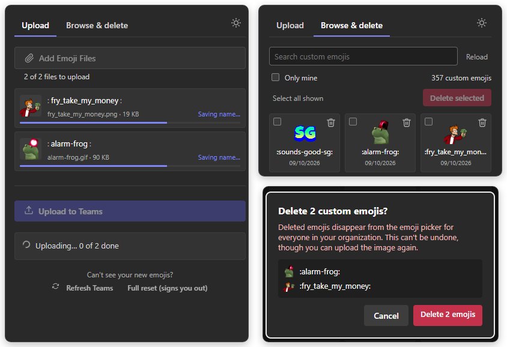

# Teams Emoji Uploader

A Chrome extension for managing your organisation's custom emojis in Microsoft Teams on the web. It opens as a side panel next to Teams, where you can upload emojis in bulk, rename them before they go up, and browse or delete existing ones.

## Features

- **Bulk upload** with previews, editable names, and progress for each file. Up to 10 upload at once, and failed ones can be renamed and retried.
- **Browse and delete** your organisation's custom emojis, with search and an "only mine" filter.
- **Safe deletes**: every delete asks for confirmation and lists what will go, and large deletes are paced to Teams' rate limit.
- **Keeps your work**: the file list and running uploads survive closing the panel.
- **Refresh Teams** with one click so new emojis appear, without signing you out.
- **Light and dark themes** in Teams' default colours.

## Documentation

- [Installation](./docs/installation.md)
- [Usage](./docs/usage.md)
- [How it works](./docs/how-it-works.md): Teams endpoints and permissions
- [Development](./docs/development.md)

## Contributing

Contributions are welcome. Please open a pull request.

## License

[MIT License](LICENSE)
