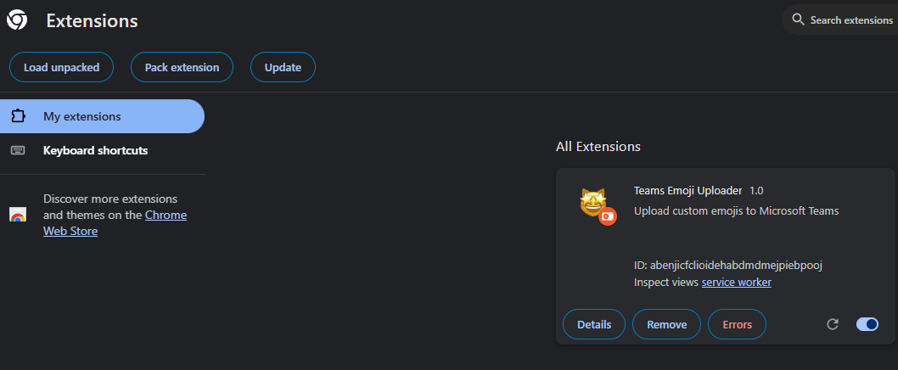

# Installation

## Requirements

- Chrome 114 or later, or another Chromium-based browser that supports extension side panels.
- Teams open in the browser at `teams.microsoft.com` or `teams.cloud.microsoft`, and signed in.
- Permission to add custom emojis in your organisation. Teams may only let you delete emojis you added yourself.

## Chrome Web Store

[Teams Emoji Uploader](https://chromewebstore.google.com/detail/teams-emoji-uploader/mlajagdepghhbclefnmcdnjfhfdmoofo) is the published version of the upstream project. It may not have every feature in this repository yet.

## From source

1. Clone this repository.
2. Install dependencies and build:

   ```console
   npm install
   npm run build
   ```

3. Open `chrome://extensions` and turn on **Developer mode**.
4. Click **Load unpacked** and select the repository folder.

   

5. Open Teams in the browser and click the extension's toolbar icon to open the side panel.

After changing the code, run `npm run build` again and click the reload icon on the extension's card in `chrome://extensions`.
